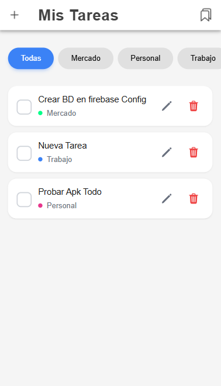
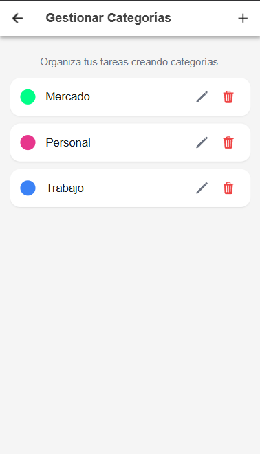
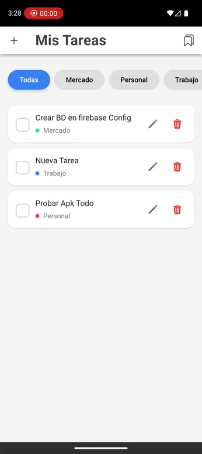

<div align="center">

# 🧩 Todo List Mobile

<br>


</div><br>

## ✨ Introducción

Una **lista de tareas pendientes**, comúnmente conocida como **to-do list** o **task list**, es una lista de cosas por hacer.  
Contiene, básicamente, cualquier actividad que debes realizar; aunque, tener la lista por escrito no significa necesariamente que sea útil.

Esta aplicación busca **hacer tu lista realmente práctica**, con una interfaz moderna, recordatorios visuales y la posibilidad de **organizar tus tareas por categorías**.


## 🚀 Características

- ✅ Crear, editar y eliminar tareas  
- 🕒 Marcar tareas como completadas o pendientes  
- 🗂️ Crear **categorías personalizadas** (por ejemplo: Trabajo, Personal, Estudio, Compras)  
- 🏷️ Asignar una categoría al crear cada tarea  


## 🛠️ Tecnologías

- **Ionic 7**
- **Angular 20**
- **Cordova**
- **TypeScript**
- **Firebase**


## 🧱 Estructura del proyecto

```
todo-list-mobile-ionic/
├── src/
│   ├── app/
│   │   ├── core/
│   │   │   └── services/
│   │   ├── data/
│   │   │   └── repositories/
│   │   │       ├── category.repository.impl.ts
│   │   │       └── task.repository.impl.ts
│   │   ├── domain/
│   │   │   ├── entities/
│   │   │   ├── repositories/
│   │   │   └── usecases/
│   │   ├── presentation/
│   │   │   └── pages/
│   │   │       ├── categories/
│   │   │       │   ├── categories.page.html
│   │   │       │   ├── categories.page.scss
│   │   │       │   ├── categories.page.spec.ts
│   │   │       │   └── categories.page.ts
│   │   │       └── tasks/
│   │   │           ├── tasks.page.html
│   │   │           ├── tasks.page.scss
│   │   │           ├── tasks.page.spec.ts
│   │   │           └── tasks.page.ts
│   │   └── shared/
│   │       ├── components/
│   │       └── pipes/
│   │
│   └── services/
│      ├── task.service.ts
│      └── category.service.ts
├── capacitor.config.ts
├── package.json
└── README.md
```

## 🔗 Requisitos Previos (Cordova)

Antes de comenzar, asegúrate de tener instalado lo siguiente:

### 1. Node.js y npm
- **Node.js** (v18 o superior) - [Descargar](https://nodejs.org/)
- Verifica la instalación: `node --version` y `npm --version`

### 2. Ionic CLI y Cordova
```bash
npm install -g @ionic/cli cordova
```

### 3. Android Studio
- Descarga e instala [Android Studio](https://developer.android.com/studio)
- Durante la instalación, asegúrate de incluir:
  - Android SDK
  - Android SDK Platform-Tools
  - Android SDK Build-Tools
  - Android Virtual Device (AVD)

### 4. Gradle
- Gradle se instalará automáticamente con Android Studio
- Verifica: `gradle --version`

### 5. Java Development Kit (JDK)
- JDK 17 (recomendado para Ionic 7)
- Verifica: `java -version`

### 6. Variables de Entorno
Configura las siguientes variables de entorno en tu sistema:

**Windows:**
```bash
ANDROID_HOME = C:\Users\TuUsuario\AppData\Local\Android\Sdk
JAVA_HOME = C:\Program Files\Java\jdk-17
Path = %ANDROID_HOME%\platform-tools;%ANDROID_HOME%\tools;%ANDROID_HOME%\build-tools
```

### 7. Verificar instalación
```bash
ionic info
cordova requirements
```

## ⚙️ Instalación

Para instalar y ejecutar este proyecto localmente, sigue estos pasos:

1. Clonar el repositorio:
    ```bash
    git clone https://github.com/tu-usuario/todo-list-mobile-ionic.git
    cd todo-list-mobile-ionic
    ```
2. Navega al directorio del proyecto:
    ```bash
    cd todo-list-mobile-ionic
    ```
3. Instala las dependencias:
    ```bash
    npm install
    ```
4. Inicia la aplicación:
    ```bash
    ionic serve
    ```

    Abre tu navegador web y navega a `http://localhost:4200/` o `http://localhost:8100/` .

5. Agregar la plataforma Android
    ```bash
    ionic cordova platform add android
    ```

## 📱 Compilación y Ejecución

1. Compilar la app web:
    ```bash
    ionic build
    ```
    Este comando compila tu código Angular y genera los archivos estáticos en la carpeta www/.

2. Usar Cordova directamente para generar el APK
    ```bash
    cordova build android
    ```

3. Lanzar el APK en el emulador
    ```bash
    cordova emulate android
    ```

4. Ejecutar en dispositivo conectado
    ```bash
    ionic cordova run android --device
    ```


## 📸 Capturas de pantalla

| 🏠 Inicio | ➕ Nueva tarea | 🗂️ Categorías  |
| --------------------------------------- | ------------------------------------------- | --------------------------------------------- |
|  |  |  |


### 🎯 Feature Flag Implementado

**`categories_feature_enabled`** - Controla la visibilidad de la funcionalidad de categorías en la aplicación.

- ✅ `false` → Las categorías están **habilitadas** (visible para usuarios)
- ❌ `true` → Las categorías están **deshabilitadas** (ocultas para usuarios)


## 🎮 Demo de Funcionalidad

### Escenario 1: Categorías Habilitadas (Default)

Cuando `categories_feature_enabled = true`:

```
Task Page
├── ✅ Sección de Categorías VISIBLE
└── ✅ Botón "Ver Categorías" VISIBLE
```

### Escenario 2: Categorías Deshabilitadas

Cuando `categories_feature_enabled = false`:

```
Task Page
├── ❌ Sección de Categorías OCULTA
└── ❌ Botón "Ver Categorías" OCULTO
```

## 🎬 Demo
<div align="center">



</div>


## 🗂️ Características Generales 

- Añadir, editar y eliminar tareas.
- Marcar tareas como completadas.
- Añadir, editar y eliminar categorías.
- Filtrar tareas por categorías.


## 🔧 Dependencias

- [Ionic 7](https://ionicframework.com/)
- [Ionic CLI](https://ionicframework.com/docs/cli)

## 👨‍💻 Autor

Desarrollado como prueba técnica para Desarrollador Mobile

---

**Versión:** 1.0.0  
**Última actualización:** 2025
