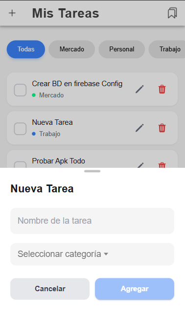

<div align="center">

# 🧩 Todo List Mobile

<br>


</div><br>

## ✨ Introducción

Una **lista de tareas pendientes**, comúnmente conocida como **to-do list** o **task list**, es una lista de cosas por hacer.  
Contiene, básicamente, cualquier actividad que debes realizar; aunque, tener la lista por escrito no significa necesariamente que sea útil.

Esta aplicación busca **hacer tu lista realmente práctica**, con una interfaz moderna, recordatorios visuales y la posibilidad de **organizar tus tareas por categorías**.


## 🚀 Características

- ✅ Crear, editar y eliminar tareas  
- 🕒 Marcar tareas como completadas o pendientes  
- 🗂️ Crear **categorías personalizadas** (por ejemplo: Trabajo, Personal, Estudio, Compras)  
- 🏷️ Asignar una categoría al crear cada tarea  


## 🛠️ Tecnologías

- **Ionic 7**
- **Angular 20**
- **Capacitor**
- **TypeScript**
- **Ionic Storage**


## 🧱 Estructura del proyecto

```
todo-list-mobile-ionic/
├── src/
│   ├── app/
│   │   ├── core/
│   │   │   └── services/
│   │   ├── data/
│   │   │   └── repositories/
│   │   │       ├── category.repository.impl.ts
│   │   │       └── task.repository.impl.ts
│   │   ├── domain/
│   │   │   ├── entities/
│   │   │   ├── repositories/
│   │   │   └── usecases/
│   │   ├── presentation/
│   │   │   └── pages/
│   │   │       ├── categories/
│   │   │       │   ├── categories.page.html
│   │   │       │   ├── categories.page.scss
│   │   │       │   ├── categories.page.spec.ts
│   │   │       │   └── categories.page.ts
│   │   │       └── tasks/
│   │   │           ├── tasks.page.html
│   │   │           ├── tasks.page.scss
│   │   │           ├── tasks.page.spec.ts
│   │   │           └── tasks.page.ts
│   │   └── shared/
│   │       ├── components/
│   │       └── pipes/
│   │
│   └── services/
│      ├── task.service.ts
│      └── category.service.ts
├── capacitor.config.ts
├── package.json
└── README.md
```

## ⚙️ Instalación

### Prerrequisitos

- Node.js (v18 o superior) - [Descargar](https://nodejs.org/)
- npm o yarn
- Git - [Descargar](https://git-scm.com/)
- Ionic CLI: `npm install -g @ionic/cli`
- Cordova: `npm install -g cordova`
- Para Android: Android Studio y SDK - [Descargar](https://developer.android.com/studio)
- Para iOS: Xcode (solo en macOS) - [Descargar](https://developer.apple.com/xcode/)

Para instalar y ejecutar este proyecto localmente, sigue estos pasos:

1. Clonar el repositorio:
    ```bash
    git clone https://github.com/tu-usuario/todo-list-mobile-ionic.git
    cd todo-list-mobile-ionic
    ```
2. Navega al directorio del proyecto:
    ```bash
    cd todo-list-app
    ```
3. Instala las dependencias:
    ```bash
    npm install
    ```
4. Inicia la aplicación:
    ```bash
    ionic serve
    ```
5. Compilar para Android / iOS
    ```bash
      ionic cap build android
      ionic cap build ios
    ```

Abre tu navegador web y navega a `http://localhost:4200/` o `http://localhost:8100/` .

## 📸 Capturas de pantalla

| 🏠 Inicio | ➕ Nueva tarea | 🗂️ Categorías  |
| --------------------------------------- | ------------------------------------------- | --------------------------------------------- |
|  |  |  |


## 🗂️ Características

- Añadir, editar y eliminar tareas.
- Marcar tareas como completadas.
- Añadir, editar y eliminar categorías.
- Filtrar tareas por categorías.


## 🔧 Dependencias

- [Ionic 7](https://ionicframework.com/)
- [Ionic CLI](https://ionicframework.com/docs/cli)

## 👨‍💻 Autor

Desarrollado como prueba técnica para Desarrollador Mobile

---

**Versión:** 1.0.0  
**Última actualización:** 2025
